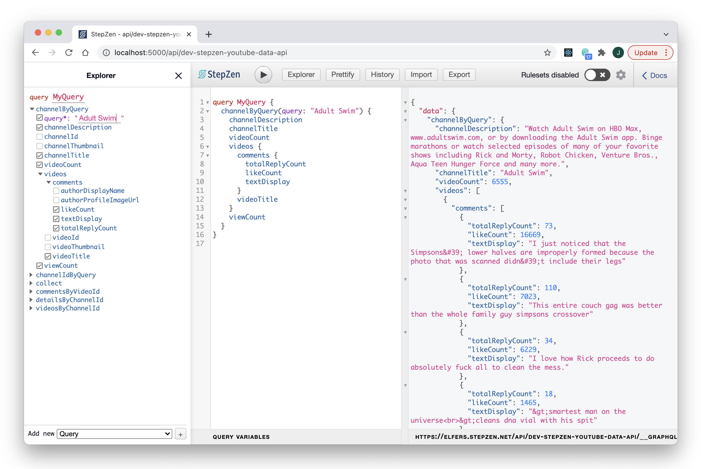

  <p align="center">
    
  </p>


This repo contains the code referenced in the two StepZen posts below, an explainer and a walkthrough:

- [New Workflows For API Mash-Ups (Oct 2021)](): **Postman, StepZen & YouTube Data API**


  > With my StepZen and Postman workspaces side-by-side, I was able to achieve something remarkable: a localhost and live endpoint serving custom-aggregated YouTube-Data-as-GraphQL, after barely a day-and-a-half of experimentation. 

- [Step-by-StepZen (Oct 2021)](): **Sorting YouTube Comments, Reddit-Style**

  > When I saw my data reflected back to me like this–not just stripped down but intelligible, virtually readable–I knew I’d stumbled upon a necessary feedback loop, and an indispensable new toolchain for API development.

Also collecting my cheatsheets here for the moment: StepZen doc pages I relied upon heavily, a few beginner questions I've resolved, and my new project checklist. 

### Most Useful StepZen Docs IMO

- [CONNECTING BACKENDS // How to Connect to a REST Service](https://stepzen.com/docs/connecting-backends/how-to-connect-a-rest-service) This is the most complete single-page StepZen walkthrough at the moment, I think.

- [DESIGN A GRAPHQL SCHEMA // Create Schema Files by Writing Code](https://stepzen.com/docs/design-a-graphql-schema#create-schema-files-by-writing-code) The 4-point checklist in this section is the most succinct schema starter; minimum requirements before you run ```stepzen start```.

- [DESIGN A GRAPHQL SCHEMA // How to Create a Sequence of Queries](https://stepzen.com/docs/design-a-graphql-schema/sequencing-queries) My schema adapts and (slightly) extends this super-followable walkthrough of a multi-part StepZen sequence. I had to remind myself of their debugging advice in the "Testing" section a few times.
<p align="center">
  
</p>

### My Personal FAQs (and Answers)
- **Should I re-use endpoints or create a new one per project?** Not if you want a legible endpoint.
- **Do I need to login again for a new project?** No, you’re installed and logged in globally.
- **Where should I install StepZen?**  Doesn’t matter, but I keep my schemas and YAML in a Stepzen folder. Be sure to run `stepzen start` from that folder.
- **What files should I have saved before I run stepzen start?**  A .graphql file, an index.graphql file, and a config.yaml.
- **What if I’m planning on committing code?**  Add a .env.local and a .gitignore. 
- **What’s the minimum I need to define a type in my graphql file?**  One type, one field, one query, and one endpoint.
- **How do I build a schema?**  Let your API suggest Types and fields through Postman. Postman is the best place to gather the two most important inputs to a StepZen-enhanced GraphQL schema: endpoint URLs and JSON responses.
- **How do I iterate my schema and add APIs?**  Itemize missing fields, solve with dependent query.


### My Starter Project Checklist

- [ ] **a type idea** in this case, ```Comments.```
- [ ] **project name** slug-case, for your endpoint URL
- [ ] **API docs URL** save API explorer pages as Postman 
- [ ] **API key or token** confirm and save in Postman
- [ ] **StepZen key** confirm and save in Postman
