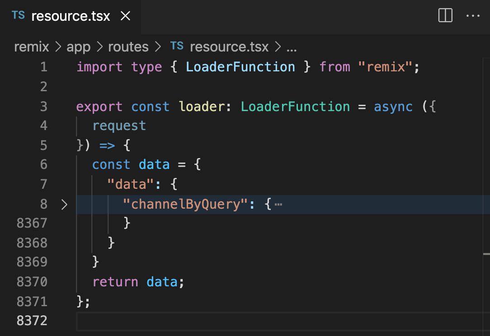

### Animating API Results (On A Budget)

#### _Developing layout animations without depleting my API quota, using Remix, Framer, and StepZen._ ####

<p align="center">
  <a target="_blank" href="https://www.youtube.com/watch?v=nyg5Lpl6AiM"></a>
</p>


<p align="center">
  <a target="_blank" href="https://www.youtube.com/watch?v=nyg5Lpl6AiM"></a>
</p>

<p align="center">
  <a target="_blank" href="https://www.youtube.com/watch?v=nyg5Lpl6AiM"></a>
</p>

```js
export const loader: LoaderFunction = async () => {
  let res = await fetch('https://remix-resource-routes.vercel.app/resource')

  let fakeData = await res.json()
  console.log('fakeData from loader', fakeData)

  ...

```


```js
export default function Index() {
  const [liked, setLiked] = useState(true)
  const {mostLiked, mostReplied} = useLoaderData(); 
  
  useEffect(() => {}, [liked])

  ...
```


```css
section {
  display: grid;
  grid-template-columns: repeat(auto-fit, minmax(240px, 1fr));
  column-gap: 1em;
  row-gap: 1em;
}
```

```html
<motion.section layout>
  <AnimatePresence>
    { liked ? 
      mostLiked.map((comment) => {
        return <Comment
                key={comment.commentId} 
                liked={liked} 
                comment={comment} />; 
      }) : 
      mostReplied.map((comment) => {
        return <Comment
                key={comment.commentId}  
                liked={liked}
                comment={comment} />; 
      })  
    }
  </AnimatePresence>
</motion.section>
```


```html
import { motion } from "framer-motion";

export function Comment({ comment, liked }) {
  return (
    <motion.article 
      layout
      transition={{ duration: 0.8 }}
      animate={{ x: 0, opacity: 1 }}
      initial={{ x: 800, opacity: 0 }}  
      exit={{ x: -800, opacity: 0 }}
      whileHover={{
        background: `rgba(0, 0, 0, 0.3) url(${comment.videoThumbnail})`,
        backgroundSize: "cover", 
        backgroundBlendMode: "multiply",
        backgroundPosition: "center",
        transition: { duration: 0.2 }
      style={{
        background: `rgba(0, 0, 0, 0.8) url(${comment.videoThumbnail})`,
        backgroundSize: "cover", 
        backgroundBlendMode: "multiply",
        backgroundPosition: "center",}}  
      }}>
      <header dangerouslySetInnerHTML={{__html: comment.videoTitle }}>
      </header>
      <section>
        <span dangerouslySetInnerHTML={{__html: comment.textDisplay }} />
        –{comment.authorDisplayName}
      </section>
      <footer>
        { liked ? 
          `${Number(comment.likeCount).toLocaleString('en', {useGrouping:true})} Likes` :
          `${Number(comment.totalReplyCount).toLocaleString('en', {useGrouping:true})} Replies`
        }
      </footer>
    </motion.article>
  );
}
```

<p align="center">
  <a target="_blank" href="https://www.youtube.com/watch?v=nyg5Lpl6AiM"></a>
</p>