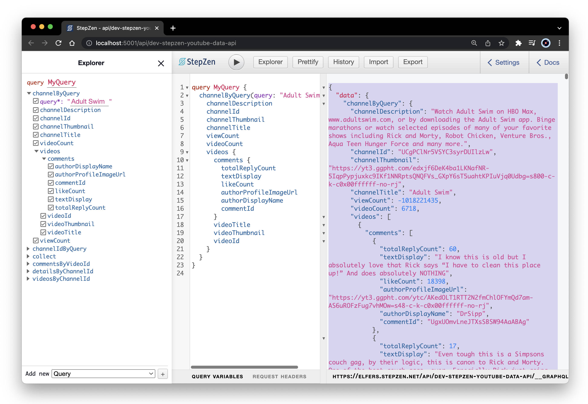

### Animating API Results (On A Budget)

#### _Developing layout animations without depleting my API quota, using Remix, Framer, and StepZen._ ####


<p align="center">
  <a target="_blank" href="https://www.youtube.com/watch?v=nyg5Lpl6AiM"></a>
</p>

I was just wrapping up Kent C. Dodd's epic <a href="https://remix.run/docs/en/v1/tutorials/jokes">six-hour Remix tutorial</a> when the React animation demo above showed up in my YouTube feed. The last time I'd played with Framer Motion, I'd run into problems with my exit animations during big container swaps–like list changes and route changes–but I was relieved to see Ed debugging exit animations towards the video's end. 

<p align="center">
  <a target="_blank" href="https://youtu.be/hsIWJpuxNj0?t=18916"></a>
</p>

With the <a href="https://remix.run/docs/en/v1/tutorials/jokes#resource-routes">last section of Dodd's mega Remix tutorial</a> fresh in mind, it struck me that a Resource Route would be the perfect place to serve cut-and-pasted API results, safe to refetch a few million times while I messed around with animated layouts.

<p align="center">
  <a target="_blank" href="https://remix.run/docs/en/v1/tutorials/jokes#resource-routes"></a>
</p>

So that's what I did. I hopped over to my local StepZen dev server and copied my preferred test response: the top 5,000 highest rated comments on Adult Swim's YouTube channel.

<p align="center">
  <a target="_blank" href="https://www.youtube.com/watch?v=nyg5Lpl6AiM"></a>
</p>

And then pasted it into a Remix route I named <code>resource.tsx</code>, a <code>LoaderFunction</code>that always returns the same mock JSON response:

<p align="center">
  <a target="_blank" href="https://www.youtube.com/watch?v=nyg5Lpl6AiM"></a>
</p>

Easily testable in the browser at my <code>/resource</code> route:

<p align="center">
  <a target="_blank" href="https://www.youtube.com/watch?v=nyg5Lpl6AiM"></a>
</p>

And just as easily fetched in my index page loader:

```js
export const loader: LoaderFunction = async () => {
  let res = await fetch('https://remix-resource-routes.vercel.app/resource')

  let fakeData = await res.json()
  console.log('fakeData from loader', fakeData)

  ...

```

Remember that your server-side console logs will show up in the terminal running your Remix dev server, not in the browser console.

<p align="center">
  <a target="_blank" href="https://www.youtube.com/watch?v=nyg5Lpl6AiM"></a>
</p>

With Ryan Florence's advocacy for API data pruning as an ideal server-side computation fresh in mind, I used the same index page <code>LoaderFunction</code> to map my 50 sets of 100 comments into two sorted arrays: Most Liked and Most Replied, whose top 100s are returned to the client. 

```js
let commentsArray: any[] = []
fakeData.data.channelByQuery?.videos.map(video => {
  video.comments.map(comment => {
    commentsArray.push({
      ...comment, 
      videoTitle: video.videoTitle, 
      videoId: video.videoId, 
      videoThumbnail: video.videoThumbnail 
    })
  })
})
// console.log('commentsArray', commentsArray)

let likeSorted = [...commentsArray].sort((a, b) => { 
  return b.likeCount - a.likeCount
})
// console.log('likeSorted', likeSorted)

let replySorted = [...commentsArray].sort((a, b) => { 
  return b.totalReplyCount - a.totalReplyCount
})

let mostLiked = likeSorted.slice(0, 100)
let mostReplied = replySorted.slice(0, 100)

return {mostLiked, mostReplied};
```

Both of which Remix easily provides to the index page component via its <code>useLoaderData</code> hook:

```js
export default function Index() {
  const [liked, setLiked] = useState(true)
  const {mostLiked, mostReplied} = useLoaderData(); 
  
  useEffect(() => {}, [liked])

  console.log('mostLiked comments from component', mostLiked)
  console.log('mostReplied comments from component', mostReplied)

  ...
```

(Which you <i>can</i> console.log in the browser.)

<p align="center">
  <a target="_blank" href="https://www.youtube.com/watch?v=nyg5Lpl6AiM"></a>
</p>

Now that I had my data, duplicating Dev Ed's layout animation came down to correctly copying in a few crucial elements. Most important of which was starting with a similar grid-template-columns formula:

```css
section {
  display: grid;
  grid-template-columns: repeat(auto-fit, minmax(240px, 1fr));
  column-gap: 1em;
  row-gap: 1em;
}
```

The trick to getting all phases of your list items' animations firing correctly seems to be <code>layout</code> tags in the <code>motion</code>-tagged container and children, with an imported <code>AnimatePresence</code> wrapping the iterable:


```html
<motion.section layout>
  <AnimatePresence>
    { liked ? 
      mostLiked.map((comment) => {
        return <Comment
                key={comment.commentId} 
                liked={liked} 
                comment={comment} />; 
      }) : 
      mostReplied.map((comment) => {
        return <Comment
                key={comment.commentId}  
                liked={liked}
                comment={comment} />; 
      })  
    }
  </AnimatePresence>
</motion.section>
```

And Framer-Motion animations are relegated to my <code>Comment</code> component:

```html
import { motion } from "framer-motion";

export function Comment({ comment, liked }) {
  return (
    <motion.article 
      layout
      transition={{ duration: 0.8 }}
      animate={{ x: 0, opacity: 1 }}
      initial={{ x: 800, opacity: 0 }}  
      exit={{ x: -800, opacity: 0 }}
      whileHover={{
        background: `rgba(0, 0, 0, 0.3) url(${comment.videoThumbnail})`,
        backgroundSize: "cover", 
        backgroundBlendMode: "multiply",
        backgroundPosition: "center",
        transition: { duration: 0.2 }
      style={{
        background: `rgba(0, 0, 0, 0.8) url(${comment.videoThumbnail})`,
        backgroundSize: "cover", 
        backgroundBlendMode: "multiply",
        backgroundPosition: "center",}}  
      }}>
      <header dangerouslySetInnerHTML={{__html: comment.videoTitle }}>
      </header>
      <section>
        <span dangerouslySetInnerHTML={{__html: comment.textDisplay }} />
        –{comment.authorDisplayName}
      </section>
      <footer>
        { liked ? 
          `${Number(comment.likeCount).toLocaleString('en', {useGrouping:true})} Likes` :
          `${Number(comment.totalReplyCount).toLocaleString('en', {useGrouping:true})} Replies`
        }
      </footer>
    </motion.article>
  );
}
```

Winding us up with an endlessly tweakable filter sort, gracefully transitioning a mess of CSS properties right out of the box!

<p align="center">
  <a target="_blank" href="https://stepzen-youtube-data-api.vercel.app/"></a>
</p>