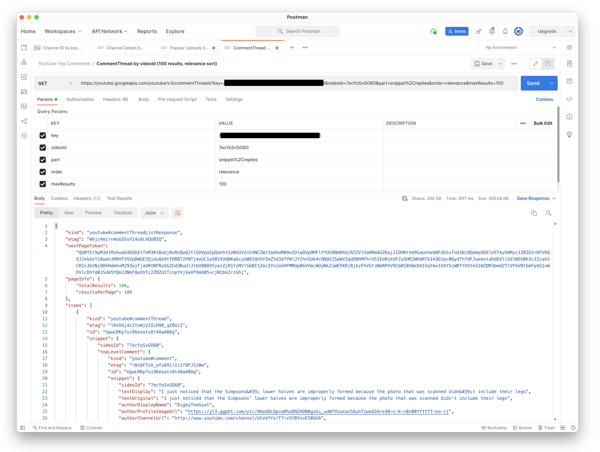
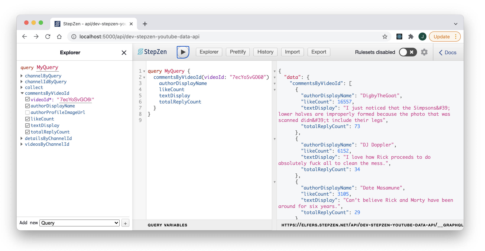

<p align="center">
  
</p>


```graphql

type ChannelId {
  channelId: String
}

type Query {
  channelIdByQuery(query: String!): ChannelId
    @rest(
      endpoint: "https://youtube.googleapis.com/youtube/v3/search?key=$key&q=$query&part=snippet&order=relevance&type=channel&maxResults=1" 
      configuration: "youtube_config"
      resultroot: "items[].id"
  )
}
```

<p align="center">
  
</p>

<p align="center">
  
</p>


```graphql

type ChannelDetails {
  channelTitle: String
  channelDescription: String
  channelThumbnail: String
  videoCount: Int
  viewCount: Int
}

type Query {
  detailsByChannelId(channelId: String!): ChannelDetails
    @rest(
      endpoint: "https://youtube.googleapis.com/youtube/v3/channels?key=$key&id=$channelId&part=snippet%2CcontentDetails%2Cstatistics"
      configuration: "youtube_config"
      resultroot: "items[]"
      setters: [
        { field: "channelTitle",
          path: "snippet.title" },
        { field: "channelDescription",
          path: "snippet.description" },
        { field: "channelThumbnail",
          path: "snippet.thumbnails.high.url" },
        { field: "videoCount", 
          path: "statistics.videoCount" },
        { field: "viewCount", 
          path: "statistics.viewCount" }
      ]
    )
}
```

<p align="center">
  
</p>


```graphql

type Channel {
  channelId: String
  channelDescription: String
  channelThumbnail: String
  channelTitle: String
  videoCount: Int
  viewCount: Int
  videos: [Video]
    @materializer(
      query: "videosByChannelId"
    )
}

type Query {
  channelByQuery(query: String!): Channel
    @sequence(
      steps: [
        { query: "channelIdByQuery" }
        { query: "detailsByChannelId" }
        { query: "collect" }
      ]
    )
  collect(
    channelId: String!, 
    channelTitle: String!,
    channelDescription: String!, 
    channelThumbnail: String!,
    videoCount: Int,
    viewCount: Int
    ): Channel
      @connector (type: "echo")  
}

```

<p align="center">
  
</p>

<p align="center">
  
</p>


```graphql

type Video {
  videoId: String
  videoTitle: String
  videoThumbnail: String
  comments: [Comment]
    @materializer(
      query: "commentsByVideoId"
    )
}

type Query {
  videosByChannelId(channelId: String!): [Video]
    @rest(
      endpoint: "https://youtube.googleapis.com/youtube/v3/search?key=$key&channelId=$channelId&type=video&order=viewCount&part=snippet&maxResults=50"
      configuration: "youtube_config"
      resultroot: "items[]"
      setters: [
        { field: "videoId",
          path: "id.videoId" },
        { field: "videoTitle",
          path: "snippet.title" },
        { field: "videoThumbnail",
          path: "snippet.thumbnails.default.url" }
      ]
    )

}

```

<p align="center">
  
</p>

<p align="center">
  
</p>


```graphql

type Comment {
  textDisplay: String
  authorDisplayName: String
  authorProfileImageUrl: String
  likeCount: Int
  totalReplyCount: Int
}

type Query {
  commentsByVideoId(videoId: String!): [Comment]
    @rest(
      endpoint: "https://youtube.googleapis.com/youtube/v3/commentThreads?key=$key&videoId=$videoId&part=snippet&order=relevance&maxResults=20" 
      configuration: "youtube_config"
      resultroot: "items[].snippet"
      setters: [
        { field: "textDisplay",
          path: "topLevelComment.snippet.textDisplay" },
        { field: "authorDisplayName",
          path: "topLevelComment.snippet.authorDisplayName" },
        { field: "authorProfileImageUrl",
          path: "topLevelComment.snippet.authorProfileImageUrl" },
        { field: "likeCount",
          path: "topLevelComment.snippet.likeCount" }
      ]
    )  
}

```

<p align="center">
  
</p>

<p align="center">
  
</p>
