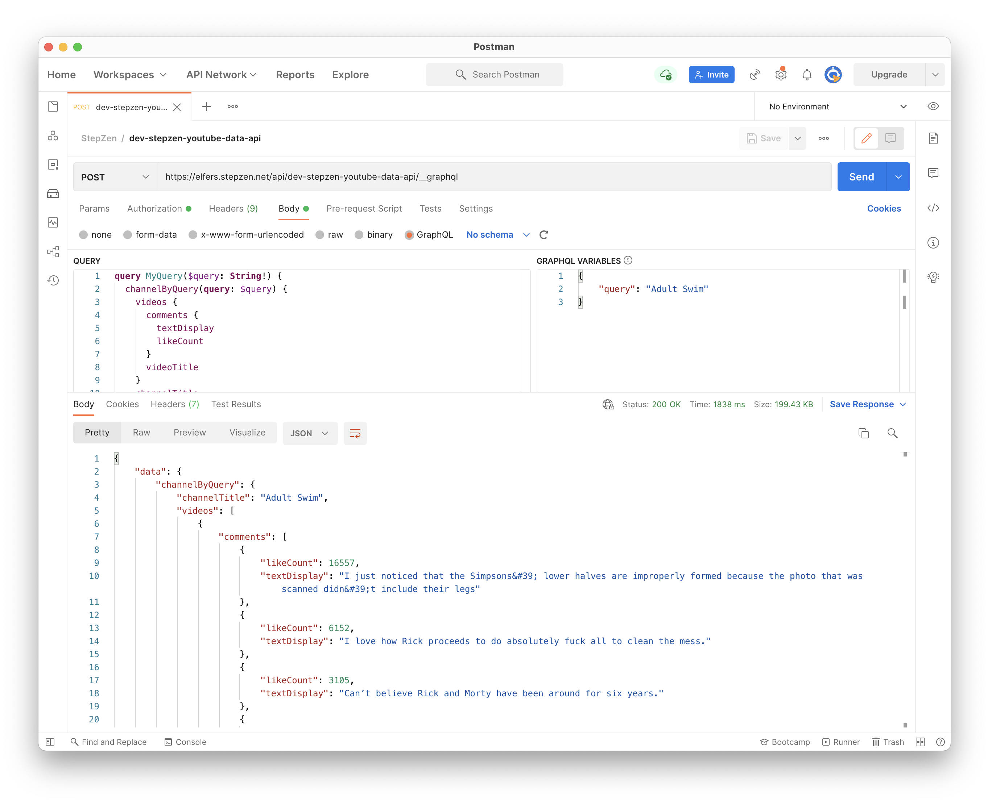

### Step-by-StepZen: Sorting YouTube Comments, Reddit-Style

Converting a 3rd-party REST API to a personal GraphQL API in StepZen, I'm currently approaching as a 3-step process: 

1. using API docs, you find your endpoint. 
2. using Postman, you test and save that endpoint. 
3. using StepZen, you link that endpoint to your schema.

Then you repeat–filling in any missing fields or Types of your schema by looking up and adding new endpoints. 

How your initial query triggers follow-up queries in StepZen is up to you: either set up explicit steps with the @sequence directive or auto-fill the fields of your schema with the @materializer directive. In the sequence below I use both methods:

#### STEP 1: Get Channel ID By Query

<p align="center">
  
</p>

```graphql

type ChannelId {
  channelId: String
}

type Query {
  channelIdByQuery(query: String!): ChannelId
    @rest(
      endpoint: "https://youtube.googleapis.com/youtube/v3/search?key=$key&q=$query&part=snippet&order=relevance&type=channel&maxResults=1" 
      configuration: "youtube_config"
      resultroot: "items[].id"
  )
}
```

<p align="center">
  
</p>

#### STEP 2: Get Channel Details By Channel ID

<p align="center">
  
</p>


```graphql

type ChannelDetails {
  channelTitle: String
  channelDescription: String
  channelThumbnail: String
  videoCount: Int
  viewCount: Int
}

type Query {
  detailsByChannelId(channelId: String!): ChannelDetails
    @rest(
      endpoint: "https://youtube.googleapis.com/youtube/v3/channels?key=$key&id=$channelId&part=snippet%2CcontentDetails%2Cstatistics"
      configuration: "youtube_config"
      resultroot: "items[]"
      setters: [
        { field: "channelTitle",
          path: "snippet.title" },
        { field: "channelDescription",
          path: "snippet.description" },
        { field: "channelThumbnail",
          path: "snippet.thumbnails.high.url" },
        { field: "videoCount", 
          path: "statistics.videoCount" },
        { field: "viewCount", 
          path: "statistics.viewCount" }
      ]
    )
}
```

<p align="center">
  
</p>


#### STEP 2A: Collect Channel Details

```graphql

type Channel {
  channelId: String
  channelDescription: String
  channelThumbnail: String
  channelTitle: String
  videoCount: Int
  viewCount: Int
  videos: [Video]
    @materializer(
      query: "videosByChannelId"
    )
}

type Query {
  channelByQuery(query: String!): Channel
    @sequence(
      steps: [
        { query: "channelIdByQuery" }
        { query: "detailsByChannelId" }
        { query: "collect" }
      ]
    )
  collect(
    channelId: String!, 
    channelTitle: String!,
    channelDescription: String!, 
    channelThumbnail: String!,
    videoCount: Int,
    viewCount: Int
    ): Channel
      @connector (type: "echo")  
}

```

#### STEP 3: Get Videos By Channel ID


<p align="center">
  
</p>


```graphql

type Video {
  videoId: String
  videoTitle: String
  videoThumbnail: String
  comments: [Comment]
    @materializer(
      query: "commentsByVideoId"
    )
}

type Query {
  videosByChannelId(channelId: String!): [Video]
    @rest(
      endpoint: "https://youtube.googleapis.com/youtube/v3/search?key=$key&channelId=$channelId&type=video&order=viewCount&part=snippet&maxResults=50"
      configuration: "youtube_config"
      resultroot: "items[]"
      setters: [
        { field: "videoId",
          path: "id.videoId" },
        { field: "videoTitle",
          path: "snippet.title" },
        { field: "videoThumbnail",
          path: "snippet.thumbnails.default.url" }
      ]
    )

}

```

<p align="center">
  
</p>

#### STEP 4: Get Comments By Video ID

<p align="center">
  
</p>


```graphql

type Comment {
  textDisplay: String
  authorDisplayName: String
  authorProfileImageUrl: String
  likeCount: Int
  totalReplyCount: Int
}

type Query {
  commentsByVideoId(videoId: String!): [Comment]
    @rest(
      endpoint: "https://youtube.googleapis.com/youtube/v3/commentThreads?key=$key&videoId=$videoId&part=snippet&order=relevance&maxResults=20" 
      configuration: "youtube_config"
      resultroot: "items[].snippet"
      setters: [
        { field: "textDisplay",
          path: "topLevelComment.snippet.textDisplay" },
        { field: "authorDisplayName",
          path: "topLevelComment.snippet.authorDisplayName" },
        { field: "authorProfileImageUrl",
          path: "topLevelComment.snippet.authorProfileImageUrl" },
        { field: "likeCount",
          path: "topLevelComment.snippet.likeCount" }
      ]
    )  
}

```

<p align="center">
  
</p>


#### STEPZEN: Get Comments By Channel Query


<p align="center">
  
</p>

<p align="center">
  
</p>
